## 背景

github在国内访问很慢，所以日常想使用gitee，然后代码镜像同步到github备份。

gitee支持导入github的仓库，所以先创建一个github的仓库，然后在gitee中导入，再设置镜像，可以实现双向同步。

## 准备工作

先在github、gitee中创建两个对应的组织

在github的组织里找到设置

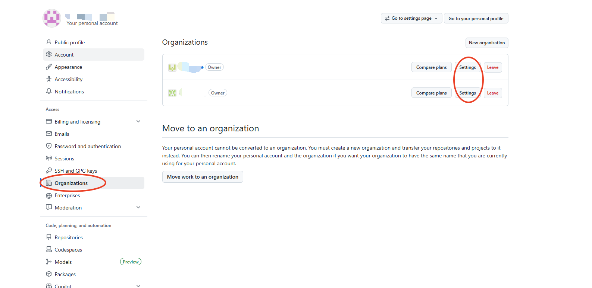

github的组织设置令牌允许不过期

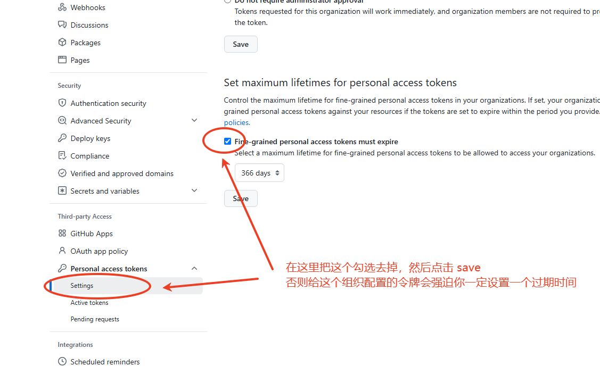

## 创建github的令牌

1. 在GitHub找到设置

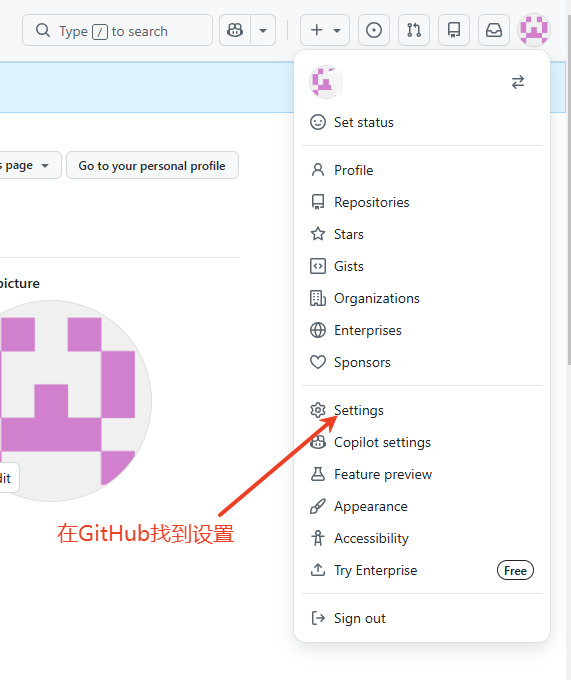

2. 设置的最下面找到开发者设置

在设置的左侧菜单里，最下面找到开发者设置

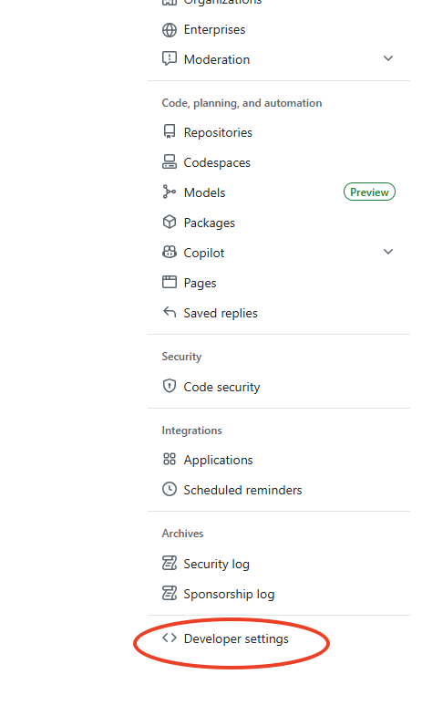

3. 选择这个细粒度的令牌

看个人习惯，也可以设置别的令牌，这种细粒度的令牌可以管控的细节更多更灵活而已

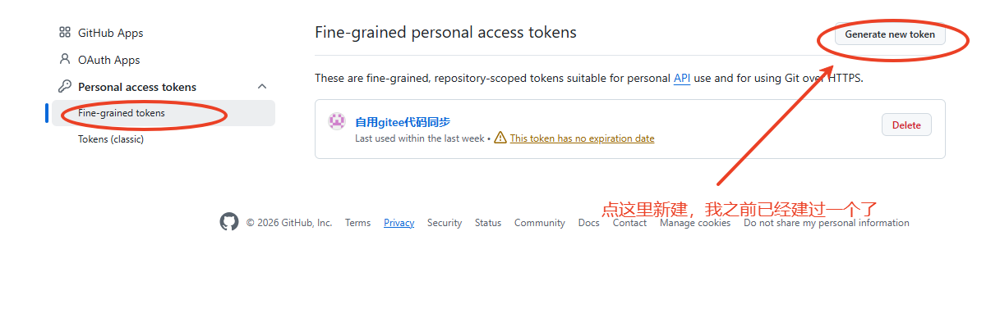

4. 令牌的基础设置

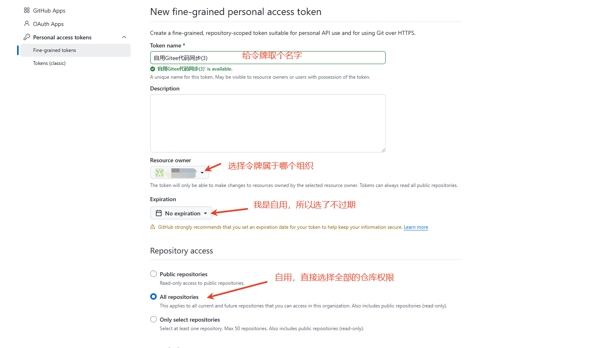

5. 令牌的权限设置

这里自己找工具翻译着看吧，如果是自用的，可以先照着添加，代码提交合并的权限，还有工作流、Webhook等我需要用到的我都开了。

如果不是自已用的，翻译一下只选择需要的吧。

令牌的权限设置1

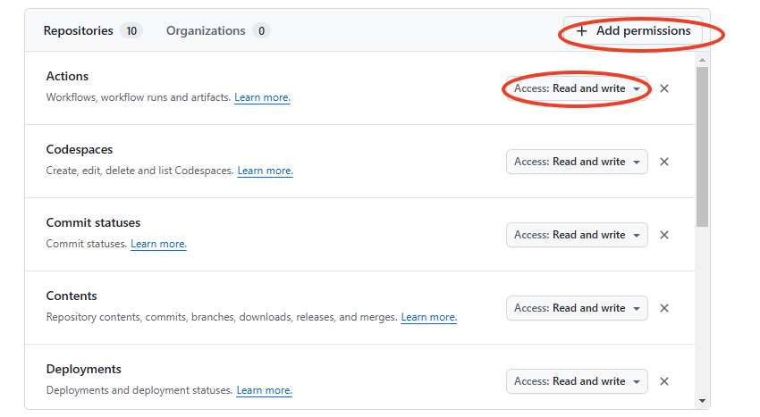

令牌的权限设置2

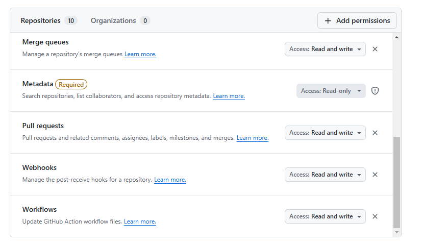

记录好你的令牌，页面刷新就看不到了，一会要用的

## 先在github创建一个仓库

由于私有项目在gitee导入的时候需要账号密码，这里偷个懒，先创建公开的，导入gitee之后再设置私有

## 在gitee中导入git仓库

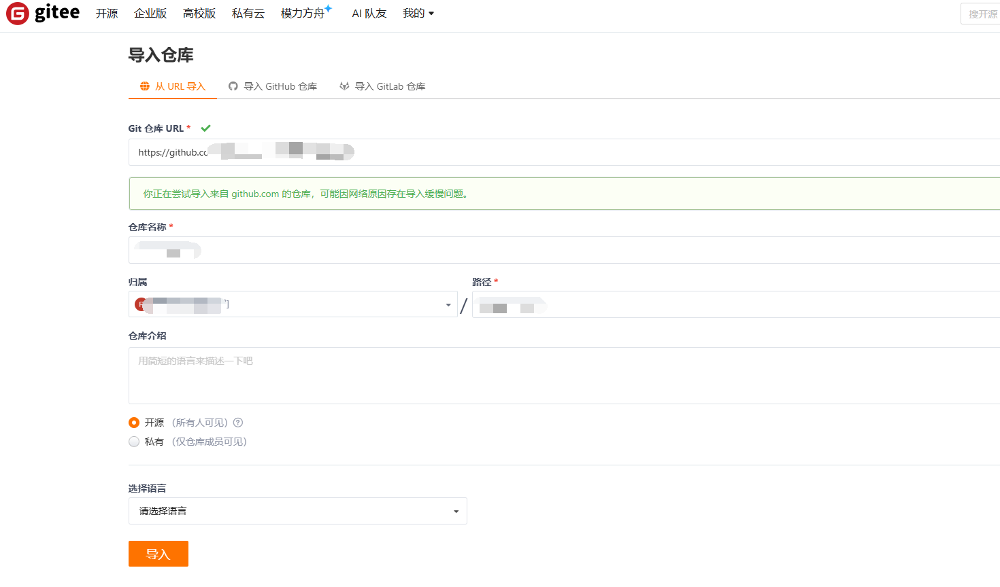

## 从github中同步到gitee

点这里的刷新，就可以从github中同步代码到gitee了

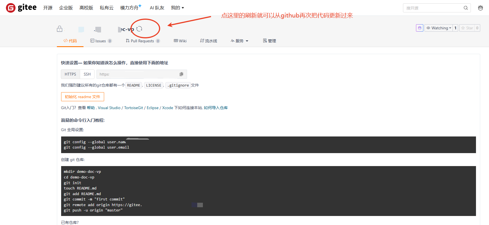

## 在gitee里设置仓库镜像

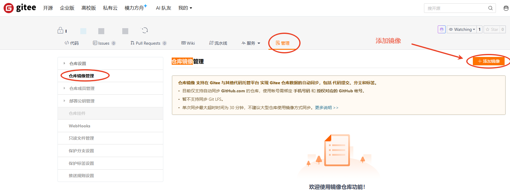

## 在gitee里添加仓库镜像

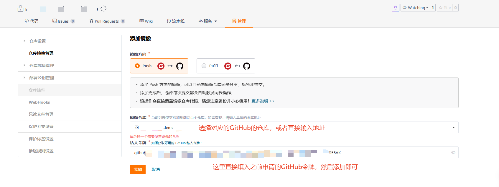

## 完成验证

在gitee这边提交代码，就会自动推送github那边同步，国内访问github会很慢的时候就直接利用gitee镜像仓库

