## 资源选择

- DigitalPlat：域名供应商，Cloudflare 支持，功能全面，支持多种后缀，注册流程友好。

- Cloudflare：赛博活佛不解释。

## 责任划分

- DigitalPlat：注册域名，域名到期续约，域名的解析权托管给Cloudflare。

- Cloudflare：域名的解析、添加二级域名。

## 注册

- DigitalPlat官网：https://digitalplat.org/

- DigitalPlat注册链接：https://dash.domain.digitalplat.org/

- 注册流程暂省略（绑定GitHub账号之后 “Star”他们的项目可以额外获得一个免费的域名）
  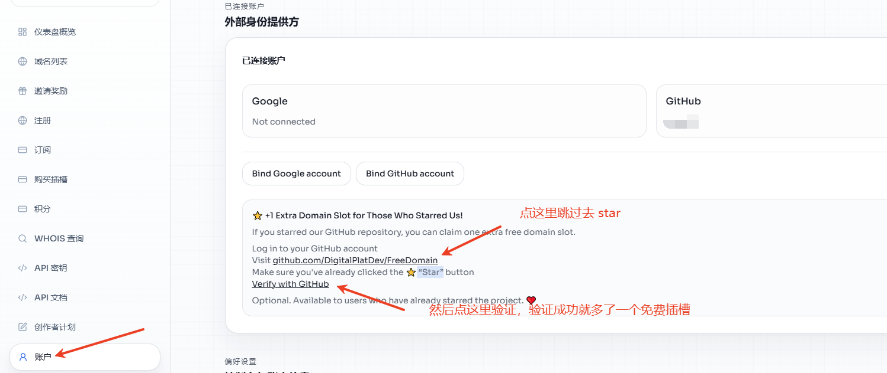

## 申请一个免费域名

先在 DigitalPlat 点击注册，申请一个域名，然后复制域名去添加到Cloudflare
1. 点击`注册`模块
2. 输入域名，勾选`我已认真阅读....`，点`检查可用性`
3. 如果域名可用，复制域名去托管到Cloudflare

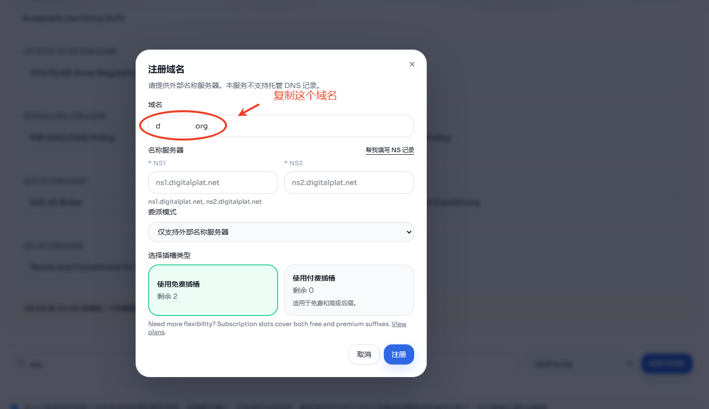

## 开始托管域名

点击Cloudflare这里添加域名

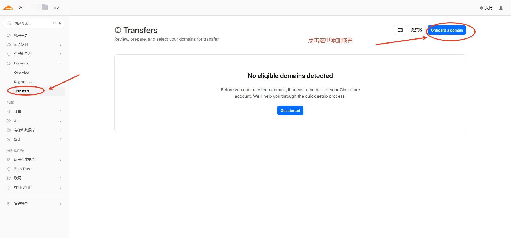

## 在Cloudflare这里输入域名

在Cloudflare这里输入域名点确认

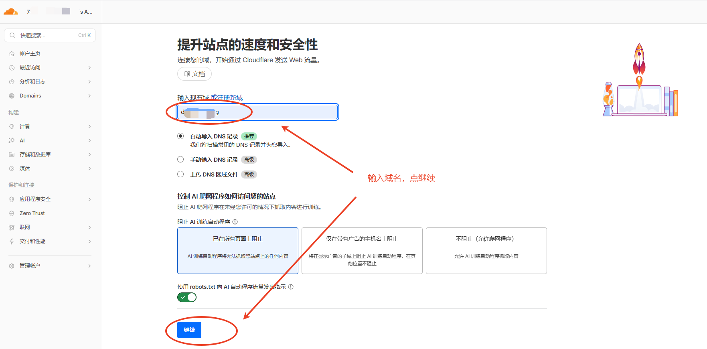

## 选择Cloudflare的免费计划

选择Cloudflare的免费计划即可

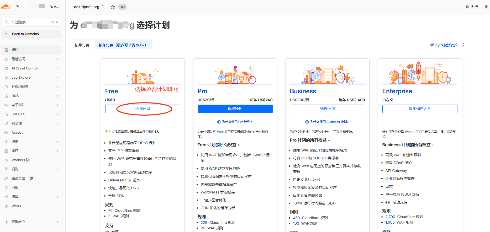

## 激活

Cloudflare点继续前往激活

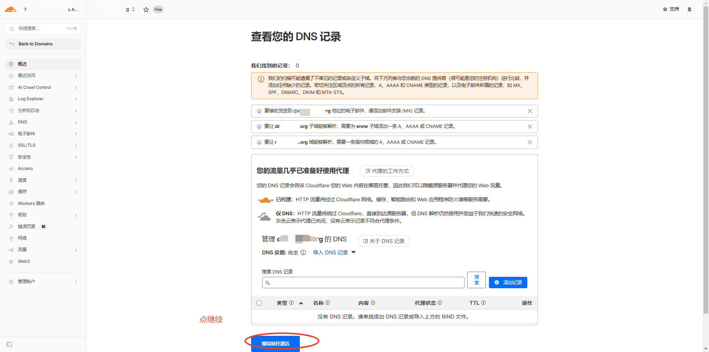

以后添加DNS记录，直接确认即可

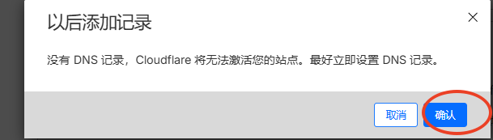

## 拿到名称服务器地址

这时候，Cloudflare会分配两个名称服务器地址

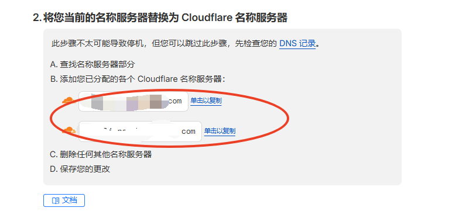

## 添加名称服务器地址

现在复制这两个地址，在DigitalPlat的DNS设置页面填入这两个地址

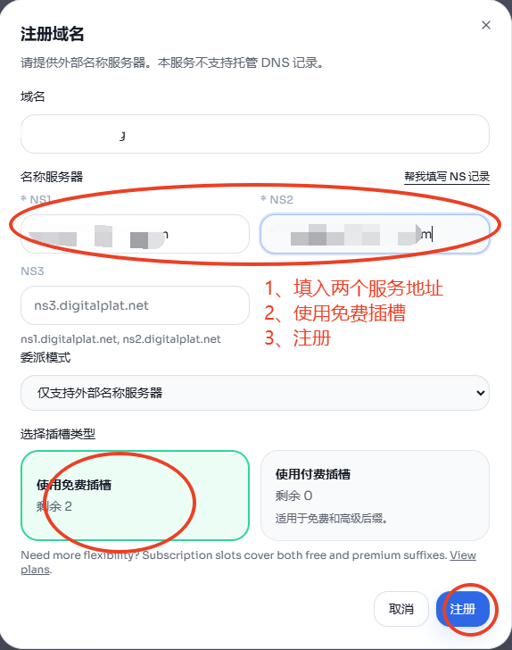

DigitalPlat的域名管理页面，可以看到到期日期，记得即时续约，避免免费域名被回收

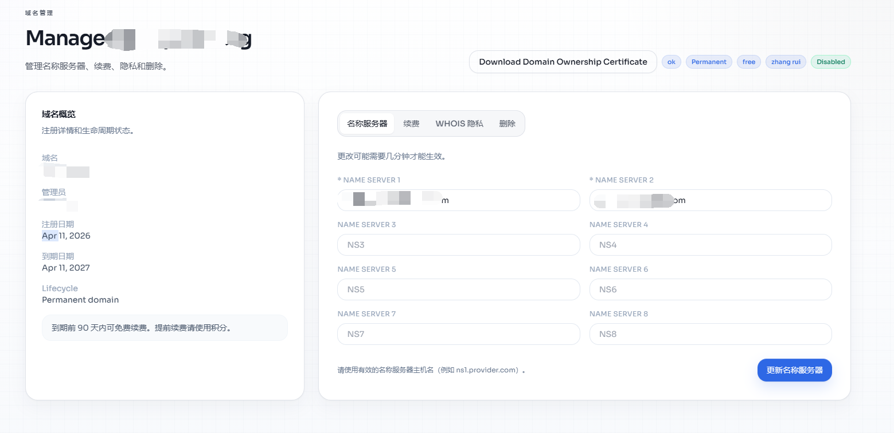

## 回到Cloudflare检查

Cloudflare点击我已更新名称服务器

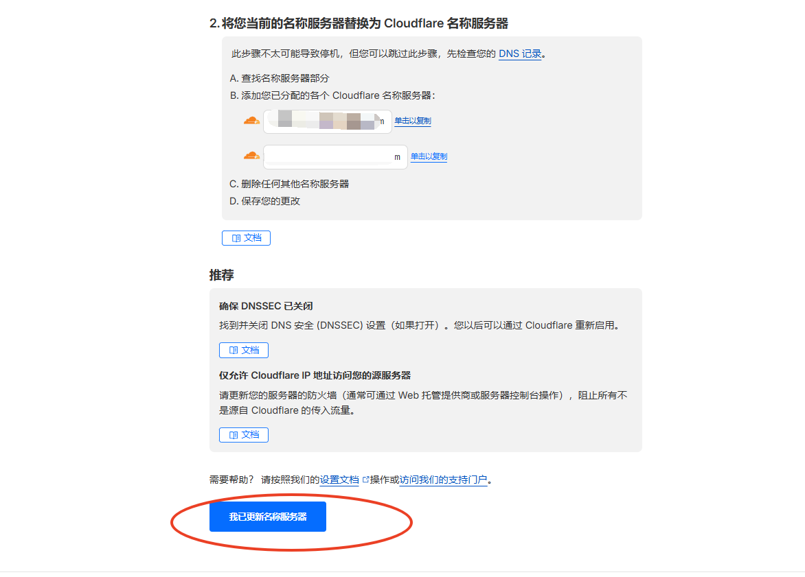

Cloudflare点击立即检查名称服务器，确认后等待 DNS 生效，通常需要 1–2 小时。

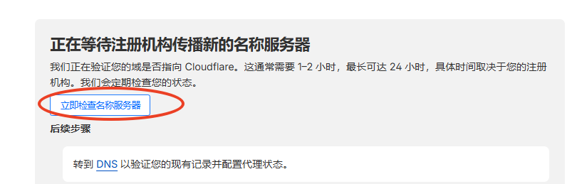

