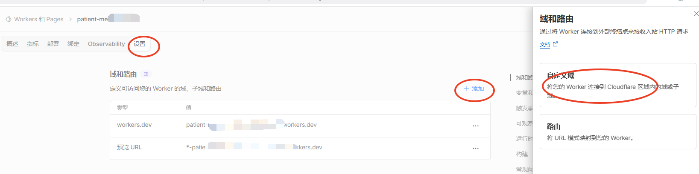
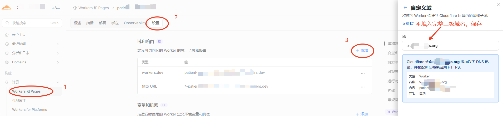

## 背景

Worker 的原本域名容易遭受DNS污染，经常无法正常访问。

## 在Worker的设置里添加自定义域

在Worker添加自定义域

## 添加一个二级域名

给Worker设置一个完整的二级域名（不能是已经存在的域名，这里会傻瓜式的创建一个二级域名）

## 验证

- 直接访问二级域名即可调用到Worker

- 而且在域名的在DNS里自动创建一个类型为Worker 的记录